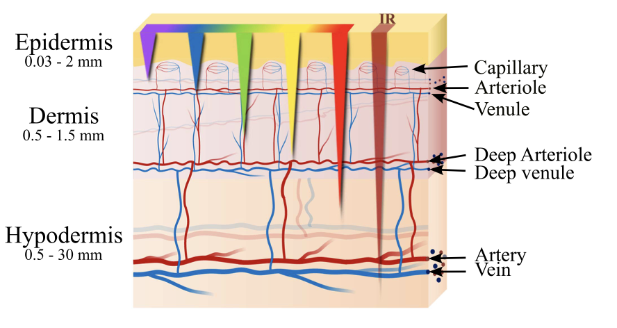

We are pleased to share the publication of a new methodological review in *IEEE Reviews in Biomedical Engineering* titled:

**“Optical Techniques to Assess Cutaneous Microvascular Function in Cardiovascular Disease.”**

<!--  -->

The review was led by colleagues at the University of Turku (coordinator of the Horizon Europe **STIMULUS** project) and brings together an international consortium of researchers, including contributions from NTUA.

Microcirculation plays a central role in cardiovascular health, and dysfunction at the microvascular level is increasingly recognized as an early marker of cardiovascular disease (CVD). The skin provides an accessible and non-invasive window to study systemic microvascular function.

This review provides a structured overview of optical techniques used to assess cutaneous microvascular function, covering both non-coherent and coherent light approaches, including:

- Near-infrared spectroscopy (NIRS)  
- Photoplethysmography (PPG) and remote PPG  
- Hyperspectral imaging (HSI)  
- Laser speckle contrast imaging (LSCI)  
- Diffuse correlation spectroscopy (DCS)  
- Photoacoustic imaging (PAI)  
- Laser Doppler flowmetry (LDF)  
- Self-mixing interferometry (SMI)  
- Optical coherence tomography (OCT)  

Beyond technical principles, the article evaluates the clinical relevance, technical maturity, and translational potential of these methods in cardiovascular research. Emerging directions such as multimodal optical monitoring and machine-learning-assisted analysis are also discussed.

This publication aligns closely with our research interests in optical sensing and non-invasive hemodynamic monitoring, as well as with ongoing European efforts to develop digital biomarkers derived from microcirculation.

The article is available via IEEE Xplore:

https://ieeexplore.ieee.org/document/11339192